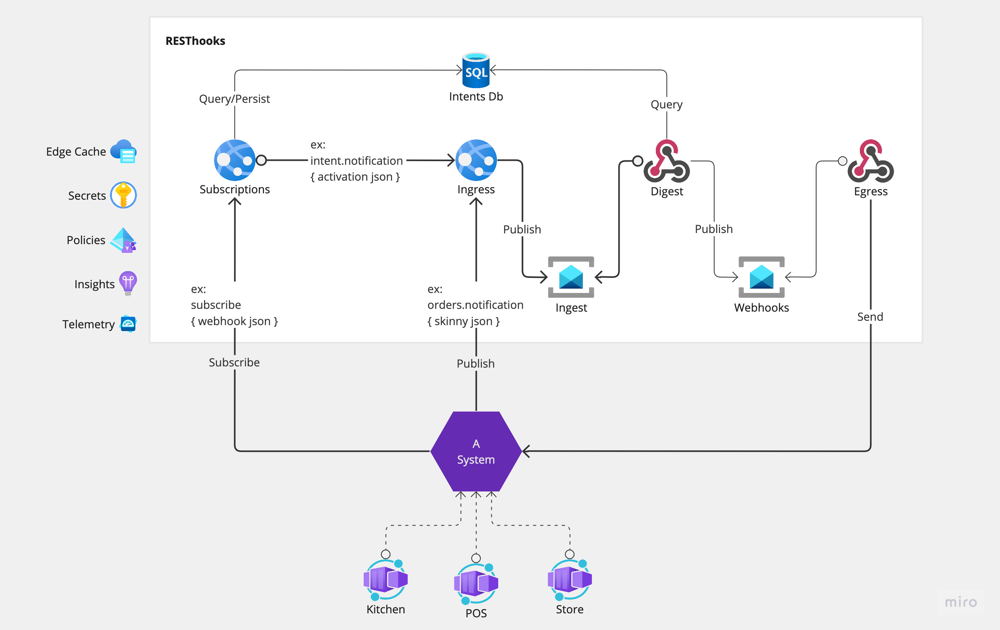

# RESThooks on Microsoft Service Fabric

This is a flavor of [RESThooks][resthooks] implementation on Microsoft Service Fabric.

> Originally, this was created to tryout a scalable publisher/subscriber design around a message broker like [RabbitMQ][rmq] or [Azure Service Bus][asb].

[resthooks]: https://resthooks.io
[rmq]: https://
[asb]: https://

### What's included:

In case you were wondering, this code is:

- Originally, written on a Mac with Windows 10 in Colombo, Sri Lanka.
- Written in C# with Visual Studio 2022.
- Built on .NET 7 with Service Fabric.
- Pub/Sub as Fanout on RabbitMQ, thanks Docker.
- Stored as JSON-data on Azure SQL, thanks to Docker.
- Served with Mock Servers on Postman.

## Build and Run from the Source

If you are completely new to .NET and Service Fabric, the [.NET Learning Center][ms-docs-dotnet-learning-center] is a good source of information. First, you want to ensure [Service Fabric Local Cluster][sf-local-devenv-setup] is up and running. Then you can build and run from the source, like you typically do for any other .NET project.

[ms-docs-dotnet-learning-center]: https://dotnet.microsoft.com/en-us/learn
[sf-local-devenv-setup]: https://learn.microsoft.com/en-us/azure/service-fabric/service-fabric-get-started

With SF Local Cluster Manager:

- Reset Local Cluster.
- Switch Cluster Mode to `1 Node`, and
- Start Local Cluster.

With Visual Studio:

- Set Startup Project to `src/Host/Skol.Resthooks.Fabric.sfproj`.
- Ensure Solution Platform is set to `x64`.
- Press `F5` to launch the project.

## Emulate Azure SQL and RabbitMQ

First, you want to ensure Docker is up and running. Then you'll be able to spin up Azure SQL for data and RabbitMQ for messaging. Luckily, `.devcontainer/` directory contains the `compose-dev.yml` script.

With Terminal:

- Run `docker info` to verify Docker is up and running.

- Run `docker compose -f .devcontainer/compose-dev.yml up -d`.

## Create a SQL Database for Subscriptions

Next, you want to create a database with the seed data.

With Azure Data Studio:

- Connect to SQL Server `localhost`.
- Create a new database `Rh_IntentsDb`.

- Open the Database Project in `db/Skol.Resthooks.SqlDb` directory, and
- Publish.

> #### TODO
>
> It's not recommended to hardcode things such as database *Connection String*. So it's advisable to move them to Service Fabric Configuration or Azure Key Vault or any other preferred location like they usually do.

## Things to Tryout

Finally, you want to subscribe for a few topics, and then you can receive notifications. _Mocking with the Postman API_ is a good source to setup a few API endpoints with a mock server. Then you can tryout!

With VS Code:

- Install [REST-client extension][vscode-rest-client-ext].
- Create a `.env` file inside the `tests/e2e/` directory, and
- Paste the `HOST` and the `HOST_API_KEY` of your Mock Server.

[vscode-rest-client-ext]: https://marketplace.visualstudio.com/items?itemName=humao.rest-client

### Topics

- `GET https://localhost:9059/v1/topics` to list all the available topics to subscribe.

### Subscriptions

- `GET https://localhost:9059/v1/subscriptions` to list all the subscriptions.
- `POST https://localhost:9059/v1/subscription` to subscribe for one or more topics.
- `GET https://localhost:9059/v1/subscription/id/{guid}` to see the details of a subscription.
- `PATCH https://localhost:9059/v1/subscription/id/{guid}/activate` to activate the subscription.
- `DELETE https://localhost:9059/v1/subscription/id/{guid}` to unsubscribe.

### Messaging

- `POST https://localhost:8172/v1/messaging/publish` to send messages for subscribers.

## License

Copyright (c) Alertbox Inc. All rights reserved.

The source code is license under the [MIT license](LICENSE).

